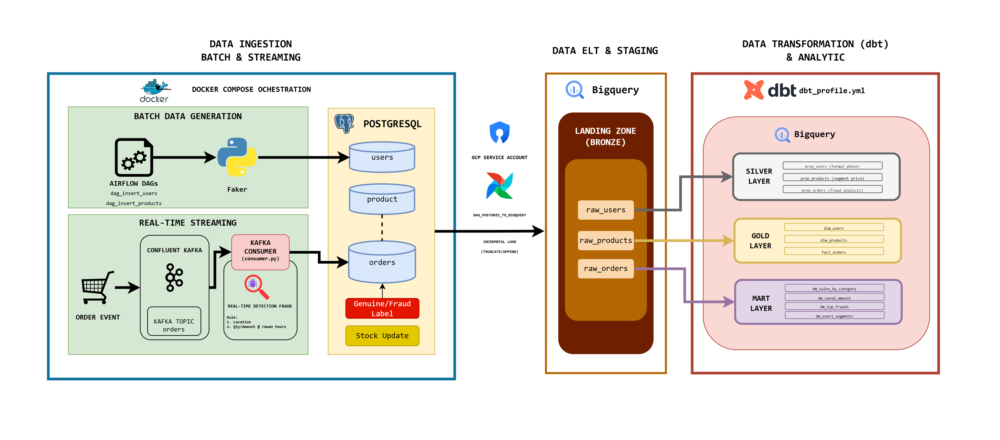
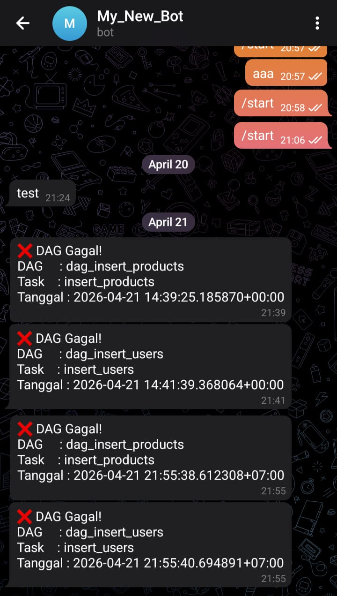

# 🛍️ Ecommerce Order Pipeline

**E-Commerce Order Pipeline — Batch & Streaming Fraud Detection**

Pipeline data e-commerce berbasis tema Barang Kecantikan yang memproses transaksi secara batch dan streaming, dilengkapi deteksi fraud secara real-time.

> Final Project — Data Engineering Bootcamp
> Purwadhika Digital Technology School | Batch JCDEAH008
> **Yosia Immanuel Bastian**

---

## 🏗️ Architecture Overview



---

## 🧰 Tech Stack

| Layer          | Tools                          |
| -------------- | ------------------------------ |
| Orchestration  | Apache Airflow 2.9.3           |
| Streaming      | Apache Kafka (Confluent 7.5.0) |
| Database       | PostgreSQL 15                  |
| Data Warehouse | Google BigQuery                |
| Transformation | DBT (dbt-core + dbt-bigquery)  |
| Notification   | Telegram Bot                   |
| Infrastructure | Docker Compose                 |
| Language       | Python                         |
| Environment    | WSL2 + Docker Desktop          |

---

## 📁 Project Structure

```
ecommerce-order-pipeline/
├── airflow/
│   ├── dags/
│   │   ├── dag_insert_users.py         # insert dummy users tiap jam
│   │   ├── dag_insert_products.py      # insert & restock produk tiap jam
│   │   └── dag_postgres_to_bigquery.py # ingest H-1 ke BigQuery (daily)
│   ├── logs/
│   ├── plugins/
│   └── requirements.txt
├── streaming/
│   ├── producer.py                     # generate & kirim order ke Kafka
│   ├── consumer.py                     # terima order, deteksi fraud, simpan ke DB
│   └── requirements.txt
├── postgres/
│   └── init.sql                        # inisialisasi tabel PostgreSQL
├── dbt/
│   ├── models/
│   │   ├── sources.yml
│   │   ├── preparation/                # prep_users, prep_products, prep_orders
│   │   ├── dim_fact/                   # dim_users, dim_products, fact_orders
│   │   └── datamart/                   # dm_top_fraud_users, dm_saved_amount, dll
│   ├── macros/
│   │   └── generate_schema_name.sql
│   ├── dbt_project.yml
│   └── profiles.yml
├── credentials/
│   └── service-account.json            # GCP service account (tidak di-commit)
├── docker-compose.yml
├── .env
└── README.md
```

---

## ⚙️ Setup & Installation

### Prerequisites

- Docker Desktop + WSL2
- Python 3.12
- GCP Service Account dengan akses BigQuery
- Telegram Bot Token (opsional, untuk notifikasi)

### 1. Clone Repository

```bash
git clone https://github.com/yosia/ecommerce-order-pipeline.git
cd ecommerce-order-pipeline
```

### 2. Setup Environment Variables

```bash
cp .env.example .env
```

Isi `.env` dengan nilai yang sesuai:

```env
POSTGRES_USER=
POSTGRES_PASSWORD=
POSTGRES_DB=ecommerce_db
POSTGRES_HOST=localhost
POSTGRES_PORT=5432

KAFKA_BOOTSTRAP_SERVERS=localhost:9092
KAFKA_TOPIC=orders

GCP_PROJECT_ID=jcdeah-008
GCP_DATASET=yosia_finpro

TELEGRAM_BOT_TOKEN=
TELEGRAM_CHAT_ID=
```

### 3. Taruh Service Account

Letakkan file service account GCP di:

```
credentials/service-account.json
```

### 4. Jalankan Docker Compose

```bash
docker compose up -d
```

Services yang akan berjalan:

- `ecommerce-postgres` → port 5432
- `ecommerce-zookeeper`
- `ecommerce-kafka` → port 9092
- `ecommerce-airflow-webserver` → port 8080
- `ecommerce-airflow-scheduler`

### 5. Akses Airflow

Buka browser dan akses:

```
http://localhost:8080
user: admin
```

Pastikan connection `postgres_ecommerce` sudah dikonfigurasi:

- Host: `postgres`
- Port: `5432`
- Database: `ecommerce_db`

---

## 🚀 Running the Pipeline

### Batch (Airflow DAGs)

DAGs akan berjalan otomatis sesuai jadwal setelah Airflow aktif:

- `dag_insert_users` — @hourly
- `dag_insert_products` — @hourly
- `dag_postgres_to_bigquery` — @daily

### Streaming (Lokal)

Jalankan producer dan consumer secara terpisah di WSL:

```bash
# terminal 1 — consumer (jalankan duluan)
cd streaming
source venv/bin/activate
python consumer.py

# terminal 2 — producer
cd streaming
source venv/bin/activate
python producer.py
```

### DBT Transformation

```bash
cd dbt
source venv/bin/activate

dbt run   # jalankan semua model
dbt test  # jalankan tests (jika ada)
```

---

## 🔍 Fraud Detection Rules

Deteksi fraud dilakukan oleh `consumer.py` sebelum order disimpan ke database:

| Rule                   | Kondisi                                  | Status    |
| ---------------------- | ---------------------------------------- | --------- |
| Foreign Transaction    | `country != "ID"`                        | `frauds`  |
| High Quantity at Night | `quantity > 100` & jam 00:00–03:59       | `frauds`  |
| High Amount at Night   | `amount > 100.000.000` & jam 00:00–03:59 | `frauds`  |
| Otherwise              | —                                        | `genuine` |

---

## 🗄️ Database Schema (PostgreSQL)

### users

| Kolom        | Type           | Keterangan            |
| ------------ | -------------- | --------------------- |
| user_id      | VARCHAR PK     |                       |
| name         | VARCHAR        |                       |
| email        | VARCHAR UNIQUE |                       |
| phone_number | VARCHAR        |                       |
| address      | TEXT           |                       |
| city         | VARCHAR        |                       |
| age          | INT            | 15–45                 |
| gender       | VARCHAR        | Laki-laki / Perempuan |
| is_active    | BOOLEAN        |                       |
| created_date | TIMESTAMP      |                       |

### products

| Kolom        | Type       | Keterangan                               |
| ------------ | ---------- | ---------------------------------------- |
| product_id   | VARCHAR PK | Format: SKC/LIP/MKP/HRC/PRF/LPC-XXXXXXXX |
| product_name | VARCHAR    |                                          |
| category     | VARCHAR    | Skincare, Lipstik, Makeup, dll           |
| brand        | VARCHAR    |                                          |
| price        | INT        |                                          |
| stock        | INT        |                                          |
| is_available | BOOLEAN    |                                          |
| created_date | TIMESTAMP  |                                          |

### orders

| Kolom          | Type          | Keterangan                |
| -------------- | ------------- | ------------------------- |
| order_id       | VARCHAR PK    | Format: ORD-XXXXXXXXXXXX  |
| user_id        | FK → users    |                           |
| product_id     | FK → products |                           |
| quantity       | INT           |                           |
| amount         | NUMERIC       | setelah diskon            |
| country        | VARCHAR       |                           |
| city           | VARCHAR       |                           |
| payment_method | VARCHAR       |                           |
| device         | VARCHAR       | mobile / desktop / tablet |
| created_date   | TIMESTAMP     |                           |
| updated_date   | TIMESTAMP     | waktu consumer proses     |
| status         | VARCHAR       | genuine / frauds          |

---

## 📊 BigQuery & DBT Layers

### Raw Layer (Bronze)

Dataset: `yosia_finpro` — hasil ingest Airflow, partitioned by `created_date`

### Preparation Layer (Silver)

Dataset: `dwh_prep_yosia_finpro` — Views

| Model           | Transformasi                                          |
| --------------- | ----------------------------------------------------- |
| `prep_users`    | Standarisasi nomor telepon → +62XXXXXXXXX             |
| `prep_products` | Tambah `price_segment`, `stock_status`                |
| `prep_orders`   | Tambah `order_hour`, `is_rawan`, `processing_time_ms` |

### Dim & Fact Layer (Gold)

Dataset: `dwh_dim_fact_yosia_finpro` — Tables

| Model          | Keterangan                                           |
| -------------- | ---------------------------------------------------- |
| `dim_users`    | + `age_group` (Gen Z / Young Adult / Adult / Mature) |
| `dim_products` | + `price_segment`, `stock_status`                    |
| `fact_orders`  | Join orders + dim_users + dim_products               |

### Datamart Layer (Gold)

Dataset: `dwh_datamart_yosia_finpro` — Tables

| Model                  | Keterangan                                                                 |
| ---------------------- | -------------------------------------------------------------------------- |
| `dm_top_fraud_users`   | User dengan transaksi fraud terbanyak                                      |
| `dm_saved_amount`      | Estimasi uang yang diselamatkan dari fraud                                 |
| `dm_sales_by_category` | Penjualan per kategori & brand                                             |
| `dm_user_segments`     | Segmentasi user: Fraud Risk / High Value / Regular / Occasional / One-time |

---

## 🔔 Notifications

Telegram notifikasi otomatis dikirim ketika **DAG gagal**, berisi:

- Nama DAG & Task
- Waktu eksekusi (WIB)



---

## 📝 Notes

- DBeaver di Windows: koneksi via IP WSL (`ip addr show eth0`)
- Airflow constraint: `constraints-2.9.3/constraints-3.12.txt`
- DBT `profiles.yml` ada di folder `dbt/` (bukan `~/.dbt/`)
- Macro `generate_schema_name.sql` digunakan agar dataset DBT tidak di-prefix otomatis oleh default schema
